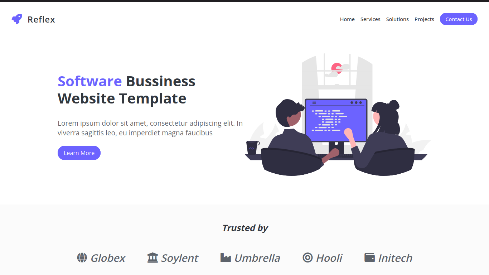

# Reflex: Software Business Website Template

## LICENSE
The template is offered for free use under the open source MIT license for any type and any number of projects.

## FILES
- index.html holds the entire content
- css/index.css all css styling
- js/index.js all js code
- img folder contains all the images

## IMAGES
All images are included in the download package and can be reused in your projects. The ones mentioned below come for outside resources. The ones not mentioned come from inside resources like created by Inovatik or purchased special license from authors. Either way you can use them for free in your project if you want.
- Project images
	- https://unsplash.com/photos/iepNMi_GrdY
	- https://unsplash.com/photos/iE71-TMrrkE
	- https://unsplash.com/photos/rtZjLrWLSK4

- Illustrations https://undraw.co/

CREDITS
- Illustrations by undraw: https://undraw.co/
- Images by Pexels: https://unsplash.com
